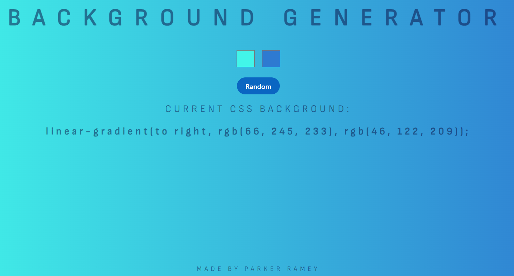
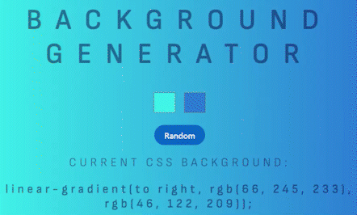
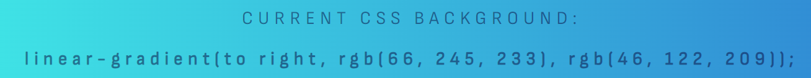
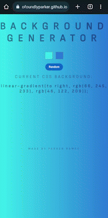

<h1 align='center'>Background Generator 
Live Site: https://profoundlyparker.github.io/Background-Generator/</h1>

This is a Zero to Mastery Complete Web Developer's course project - with some added improvements and style changes!

## How to Use:

You can choose your own colors via the color input selectors

Or, you can select the random button to choose two colors for you

## Description

A project created using <b>HTML</b>, <b>CSS</b>, and <b>JavaScript</b>, deployed on <b>GitHub Pages</b>

<i>A huge thanks to Andrei Neagoie for creating <a href='https://zerotomastery.io/courses/coding-bootcamp/'>Zero to Mastery Complete Web Developer Course</a> and the entire Zero To Mastery platform to help encourage new developers like myself to pursue their passions!</i>

A simple background generator that displays the CSS line of code to copy your generated colors into your own project

## Features
<li>Mobile-friendly</li> 

<li>Custom favicon</li> 

 

